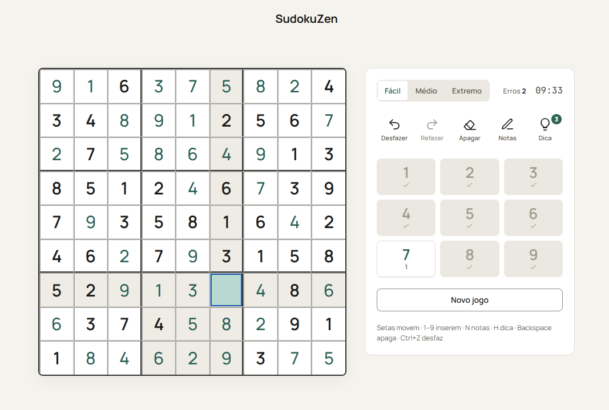
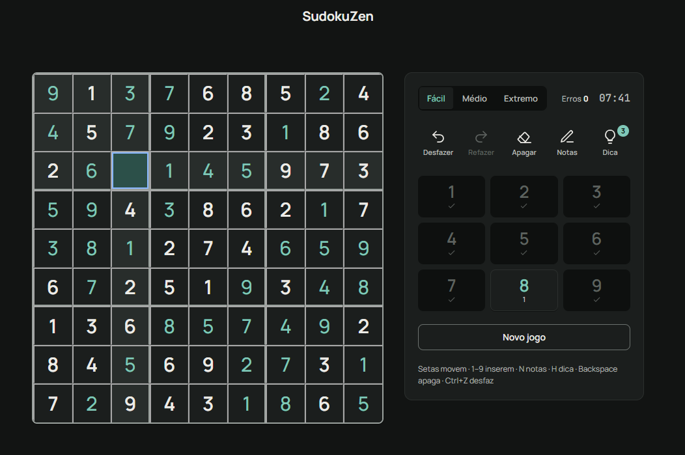
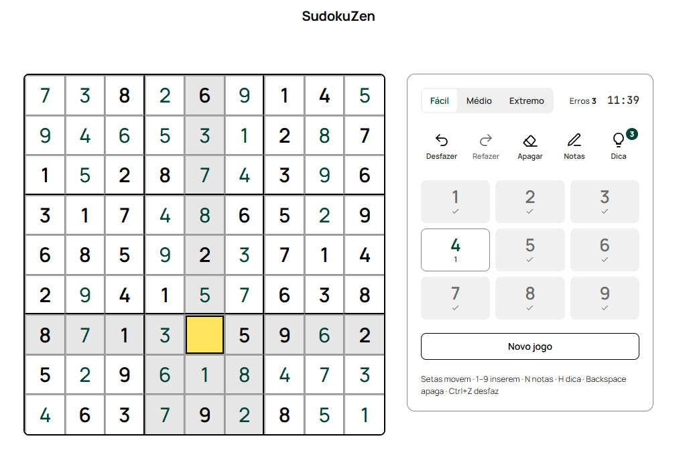
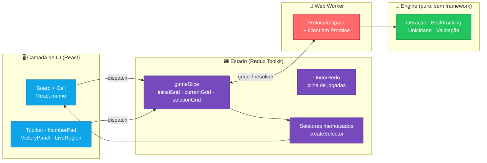

<div align="center">

# 🧘 SudokuZen

### _Onde a lógica encontra a calma._

Um Sudoku de verdade para navegador e mobile — construído não só para **jogar**,
mas como um estudo de **arquitetura limpa, performance e acessibilidade**.

Sem travar a tela. Sem re-renders desnecessários. Sem exclusão de ninguém.

<br/>

[](https://github.com/MarceloJael/SudokuZen/actions/workflows/ci.yml)
[](https://marcelojael.github.io/SudokuZen/)


<br/>


<br/>

**[▶️ Jogar agora](https://marcelojael.github.io/SudokuZen/)**

<br/>



</div>

---

## 🎐 A filosofia

Sudoku é um exercício de foco: cada número no lugar certo, cada conflito
evitado, uma decisão de cada vez. **SudokuZen** aplica a mesma disciplina ao
código — cada camada com uma única responsabilidade, cada célula renderizando
apenas quando precisa, cada geração de tabuleiro sem congelar a interface.

O resultado é um jogo simples de usar e um projeto propositalmente rigoroso por
dentro.

---

## 🎨 Três temas, um sistema de design

Todo o visual nasce de um único conjunto de _design tokens_ (ver
[`DESIGN.md`](DESIGN.md)), com três temas trocáveis pelo `data-theme` — e
**alto contraste AAA** de verdade, não só um "dark mode".

<div align="center">

| ☀️ Claro | 🌙 Escuro | 🔲 Alto contraste |
| :---: | :---: | :---: |
|  |  |  |
| Papel quente, verde-petróleo | Grafite, dígitos menta | Preto no branco, bordas grossas, seleção amarela |

</div>

O tema segue a preferência do sistema (`prefers-color-scheme` /
`prefers-contrast`) e pode ser alternado no botão do cabeçalho.

---

## ✨ O que ele faz

| | |
|---|---|
| 🎚️ **Três níveis** | Fácil, Médio e Extremo — cada tabuleiro com **solução única garantida**. |
| ⚡ **Engine em Web Worker** | Geração e _backtracking_ rodam fora da _main thread_. A tela **nunca** trava. |
| ↩️ **Undo / Redo** | Histórico eficiente baseado em **pilha de jogadas** (não em snapshots do grid). |
| 🎯 **Destaques inteligentes** | Foque uma célula → linha, coluna e quadrante acendem. Escolha um número → todas as ocorrências iguais se iluminam. |
| ✏️ **Anotações (pencil marks)** | Rabisque candidatos em cada célula, como no papel. |
| 💡 **Dicas** | Revela um dígito correto quando você empaca (3 por partida). |
| ⏱️ **Cronômetro e erros** | HUD com tempo e contagem de conflitos; painel de vitória com o resumo da partida. |
| ⌨️ **100% jogável no teclado** | Setas navegam pelas 81 células, `1-9` inserem, `N` notas, `H` dica, `Backspace` apaga, `Ctrl+Z` desfaz. |
| ♿ **Acessibilidade real** | Cada célula é um `gridcell` rotulado em português; uma região `aria-live` narra o estado; foco visível e alvos de toque ≥ 44px. |

---

## 🏛️ Arquitetura

Separação de camadas levada a sério — o **domínio não conhece o React**, e o
trabalho pesado nunca toca a UI.



| Camada | Pasta | Responsabilidade |
|--------|-------|------------------|
| 🧠 **Engine** | `src/engine/` | Lógica pura de Sudoku. Zero imports de React/DOM/Redux. |
| 🧵 **Worker** | `src/worker/` | Roda geração e solução fora da _main thread_, via protocolo de mensagens tipado. |
| 🗃️ **Estado** | `src/store/` | `gameSlice` + undo/redo em pilha + seletores memoizados. |
| 🎨 **Design** | `src/styles/`, `DESIGN.md` | Tokens + CSS de referência dos três temas. |
| 🖥️ **UI** | `src/components/`, `src/hooks/` | Componentes memoizados, navegação por teclado, anúncios de acessibilidade. |

---

## 🔬 Decisões de engenharia que dão orgulho

<details open>
<summary><b>🧩 Tipagem que prova a corretude em tempo de compilação</b></summary>

<br/>

O grid é modelado com **tuplas de tamanho fixo** — é literalmente impossível
compilar um tabuleiro que não seja 9×9.

```ts
type Nine<T> = [T, T, T, T, T, T, T, T, T];
type Grid = Nine<Nine<CellState>>;

type CellState = {
  value: number | null;
  isFixed: boolean;
  hasError: boolean;
  notes: number[];
};
```

E tudo compila sob as flags mais estritas do TypeScript: `strict`,
`noUncheckedIndexedAccess`, `exactOptionalPropertyTypes`.
</details>

<details>
<summary><b>⚡ Re-render cirúrgico: editar uma célula re-renderiza uma célula</b></summary>

<br/>

Cada `Cell` é `React.memo` alimentado por um **seletor memoizado por célula**
(`createSelector`) comparado com `shallowEqual`. Editar o `currentGrid` usa
_structural sharing_: as 80 células que não mudaram mantêm a mesma referência —
e portanto não re-renderizam.
</details>

<details>
<summary><b>🐛 A war story: o solver que "travava" nos testes</b></summary>

<br/>

O motor usa **bitmasks** para candidatos (um `AND`/`NOT` por célula em vez de
varrer 27 vizinhos). Rápido — geração Extrema em ~8ms.

Mas os testes de "tabuleiro impossível" pareciam **congelar por minutos**. 🕵️

O culpado: as máscaras rastreavam apenas a _presença_ de um dígito. Dois `5`
na mesma linha faziam `OR` no mesmo bit e passavam despercebidos — o solver
então explorava uma árvore de busca praticamente infinita tentando completar um
grid impossível.

A correção: detectar dígitos conflitantes **ao construir as máscaras** e falhar
na hora. Virou correção de **corretude _e_ de performance** — `solve` retorna
`false` / `countSolutions` retorna `0` instantaneamente.

> _Moral zen: um algoritmo rápido no caminho feliz ainda precisa saber a hora de desistir._
</details>

---

## 🚀 Rodando localmente

```bash
git clone https://github.com/MarceloJael/SudokuZen.git
cd SudokuZen
npm install

npm run dev        # 🎮 jogar em http://localhost:5173
```

### 🧰 Scripts

| Comando | O que faz |
|---------|-----------|
| `npm run dev` | Servidor de desenvolvimento (Vite). |
| `npm run build` | Type-check + build de produção. |
| `npm test` | Suíte de testes (Vitest). |
| `npm run test:coverage` | Testes com relatório de cobertura. |
| `npm run lint` | ESLint. |
| `npm run format` | Formata com Prettier. |
| `npm run typecheck` | Verificação de tipos sem emitir. |

---

## 🌐 Jogar online (GitHub Pages)

O deploy é **automático**: todo push na `main` que passar pelos testes publica a
versão nova em `https://marcelojael.github.io/SudokuZen/`.

Para ligar isso no seu fork **uma única vez**:

1. Faça push do projeto para a branch **`main`**.
2. No GitHub: **Settings → Pages → Build and deployment → Source: `GitHub Actions`**.
3. Pronto. O workflow [`ci.yml`](.github/workflows/ci.yml) roda os testes, faz o
   build e publica. O caminho base (`/SudokuZen/`) é definido automaticamente a
   partir do nome do repositório — não precisa configurar nada no `vite.config`.

> Usando domínio próprio ou outro host (Netlify/Vercel)? Basta ajustar a variável
> `VITE_BASE_PATH` no build.

---

## ✅ Qualidade

Nada entra na `main` sem passar por **cinco portões**, automatizados no
GitHub Actions:

```
  Prettier  →  ESLint  →  TypeScript  →  Vitest (52 testes)  →  Build  →  🚀 Deploy
```

A suíte cobre o coração do jogo com casos de borda de verdade: tabuleiros
impossíveis, validação de linha/coluna/quadrante, **unicidade de solução**,
geração determinística com _seed_ e o ciclo completo de undo/redo. O **engine
tem 100% de cobertura**.

```
 ✓ src/store/gameSlice.test.ts      (18 tests)
 ✓ src/engine/sudokuEngine.test.ts  (34 tests)

 Test Files  2 passed (2)
      Tests  52 passed (52)
```

---

## 🗺️ Próximos passos

- [ ] 🏆 Placar de recordes por dificuldade
- [ ] 💾 Salvar partida no `localStorage`
- [ ] 🧪 Testes de componente com Testing Library (`@vitest-environment jsdom`)
- [ ] 📱 PWA instalável (offline)

---

## 🛠️ Stack

**React 18** · **TypeScript (strict)** · **Redux Toolkit** · **Vite** ·
**Web Workers** · **Vitest** · **ESLint + Prettier** · **GitHub Actions**

---

<div align="center">

Feito com foco, café e um `git commit` de cada vez. ☕

**[⭐ Deixe uma estrela](https://github.com/MarceloJael/SudokuZen)** se este projeto te inspirou.

_por [Marcelo Jael](https://github.com/MarceloJael)_

</div>
